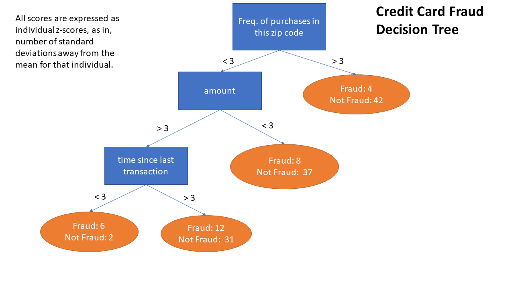

# Question: Tree Classifier

You are a credit card company. You have induced the following decision tree classifier.

A transaction comes in, and you use the model to classify it. It has the following z-score values:

    freq of purchases in this zip code: 1.2
    amount: 3.1
    time since last transaction: 4

What will be the `p_fraud` and `p_not_fraud` for this instance?

* [ ] p-fraud= .12, p-not-fraud=.31
* [ ] p-fraud= .75, p-not-fraud=.25
* [ ] p-fraud= .2791, p-not-fraud=.7209
* [ ] p-fraud= .3871, p-not-fraud=.6129

# Question: Information Gain

For this question, you will use a Game of Thrones dataset. One row represents one person. 
*The prediction target is whether or not the person is dead.* The things we know about each 
person include their gender, whether they are a noble, and whether they have dead relatives. 
Find the data [here](https://raw.githubusercontent.com/deargle/deargle.github.io/master/class/data/got_train.csv) 

Your task is to calculate the information gain for the following three features: 
1. "dead relatives?" 
2. "is noble?"
3. "gender”

## Background on information theory and entropy

[Shannon’s Information Theory](https://en.wikipedia.org/wiki/Entropy_(information_theory)) is a way to express entropy for a given dataset. 
The function represents “information” for observing a certain outcome as follows:

  
The “minus” log thing is just a grick that doctors hate him for that just inverses 
the otherwise-awkward ratio inside of the log.

The function may look intimidating, but it is just a fancy way to express the “information”, 
or “surprise” of observing a given event. Because it is base 2, the answer is on the scale of 0 to 1. 
Other bases may be used, but binary is common.

If a given dataset has two possible outcomes, then one would calculate the “information” for each outcome, 
and “weight” that information by the prevalence of that outcome in the dataset -- i.e., 
multiple the information by the proportion of that outcome. Then, add together all of the weighted proportions. 
This produces the overall “entropy” of the dataset. The formulaic representation of the weighting and summing of 

(Figures and formulae borrowed from the wikipedia article linked above, read more there if you are interested)

Your task is to calculate the information gain for if you split the Game of Thrones dataset on the three aforementioned features. You should calculate:
* The overall entropy of the unsplit dataset
* For each attribute:
   * The entropy of each child node after the segmentation
   * The overall information gain for segmenting on that particular attribute

Recall (from the book):
  

... where each c1 is the first child node, c2 the second, p(c1) is the proportion of overall points present in c1, etc. 
The entropy of each child is calculated as in the entropy(parent) function above, scoped to just the datapoints for that child.

# Questions

1. What is the overall entropy before any segmentation?
2. What is the feature with the highest information gain?
3. What is the highest information gain?
4. What is the entropy of the "is noble = yes" child node? The entropy of the "is noble = no" child node?
